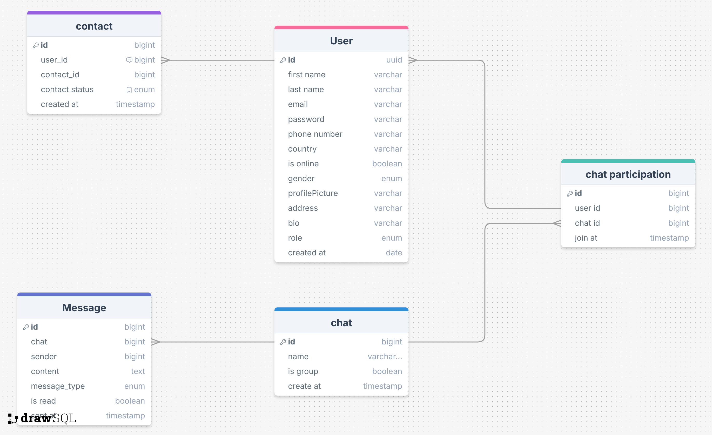

### ChatTalk — Real-time Chat Application (Desktop + Spring Boot)

A full‑stack real-time chat application showcasing production-style engineering: secure authentication, WebSocket messaging, layered architecture, CI-friendly build, and a modern JavaFX desktop client. Designed to demonstrate end‑to‑end skills for portfolio/CV.
- **Watch on YouTube:** [ChatTalk Demo](https://youtu.be/k9rVqJKAfLw)


## Highlights
- **Real-time messaging**: WebSocket-based duplex communication (Spring WebSocket on server, Tyrus client on JavaFX).
- **Security**: JWT authentication, password hashing (BCrypt), Spring Security authorization.
- **Scalable backend**: Spring Boot 3, layered architecture (controller → service → repository), JPA/Hibernate, PostgreSQL.
- **Dev/Test ready**: H2 for local/dev, JUnit 5 + Mockito for unit tests, Spring Test.
- **Media & utilities**: Cloudinary for image upload, Mail service for notifications, OpenAPI/Swagger for API docs.
- **Desktop UI**: JavaFX 23 (FXML, CSS, media), clean MV* separation, theming and sounds.

—

## Tech Stack
- **Backend**: Java 21, Spring Boot 3.2, Spring Security, Spring WebSocket, Spring Data JPA, Validation, Actuator
- **Auth**: JWT (`jjwt`), BCrypt (`spring-security-crypto`)
- **Database**: PostgreSQL (prod), H2 (runtime/dev/testing)
- **Docs**: springdoc-openapi (Swagger UI)
- **Media/Infra**: Cloudinary, JavaMail (Spring Boot Mail)
- **Testing**: JUnit 5, Mockito, Spring Boot Test
- **Frontend (Desktop)**: Java 21, JavaFX 23 (controls, FXML, graphics, media), Tyrus WebSocket client, SLF4J, Gson/Jackson

—

## Repository Structure
```
Backend (server side)/ChatTalk_ServerSide     # Spring Boot backend
Frontend (client side)/ChatTalkDesktop         # JavaFX desktop client
Docs/                                          # ERD, sequence diagrams, schema
ChatTalk desktopApplication.mp4                # Short demo video
```

—

## Key Features
- **Account lifecycle**: Sign up, login, email notification, profile update (see sequence diagrams in `Docs/`).
- **JWT-secured APIs**: Stateless authentication, role-based access with Spring Security.
- **Real-time chat**: WebSocket endpoints for sending/receiving messages and presence updates.
- **Media handling**: Upload avatars/images to Cloudinary.
- **Observability**: Spring Boot Actuator health/info.
- **API docs**: Swagger UI for quick exploration.

—

## How to Run (Backend)
Prerequisites: Java 21, Maven, PostgreSQL (or use H2 for dev)

1) Configure environment via `application.properties` or environment variables:
```
# Database (PostgreSQL)
spring.datasource.url=jdbc:postgresql://localhost:5432/chattalk
spring.datasource.username=postgres
spring.datasource.password=postgres

# JPA
spring.jpa.hibernate.ddl-auto=update

# JWT
app.jwt.secret=change_me_super_secret_key
app.jwt.expiration=86400000

# Mail
spring.mail.host=smtp.example.com
spring.mail.port=587
spring.mail.username=you@example.com
spring.mail.password=app_password
spring.mail.properties.mail.smtp.auth=true
spring.mail.properties.mail.smtp.starttls.enable=true

# Cloudinary
cloudinary.cloud-name=your_cloud
cloudinary.api-key=your_key
cloudinary.api-secret=your_secret
```

2) Start the server:
```
cd "Backend (server side)/ChatTalk_ServerSide"
mvn spring-boot:run
```

3) Open API docs (after the app starts):
```
http://localhost:8080/swagger-ui.html
```

Notes:
- For quick local dev, you can switch to H2 (already included). See `application-test.properties` for reference.

—

## How to Run (Desktop Client)
Prerequisites: Java 21, Maven

1) Configure backend URL and WebSocket endpoint in the client config (defaults typically to `http://localhost:8080`).

2) Start the JavaFX app:
```
cd "Frontend (client side)/ChatTalkDesktop"
mvn -q javafx:run
```

The client connects to the backend WebSocket (Tyrus client) and uses REST endpoints for auth/profile.

—

## Data & Design Artifacts
- ERD: `Docs/erd.png`
- Database schema: `Docs/database schema.sql`
- Sequence diagrams: `Docs/login sequence.drawio.png`, `Docs/sign up sequence.drawio.png`, `Docs/update profile sequence.drawio.png`

ERD preview:



## Skills Highlight
- **Backend Engineering**: Spring Boot 3 (Web, Security, WebSocket, Validation, JPA), layered architecture (controller/service/repository), DTO mapping, exception handling, Actuator.
- **Security & Auth**: JWT issuance/verification, stateless sessions, password hashing with BCrypt, role/authority management, secure endpoints.
- **Realtime Systems**: STOMP/WebSocket endpoints, broadcast and direct messaging patterns, presence updates, resilient client reconnection.
- **Databases**: JPA/Hibernate modeling, PostgreSQL for production, H2 for development/testing, schema migration readiness, performance-conscious querying.
- **API Design & Docs**: RESTful endpoints, OpenAPI/Swagger UI, request/response validation.
- **Desktop UI (JavaFX)**: FXML-driven views, CSS theming, media/sound integration, clean separation of concerns, error/notification UX.
- **Testing**: JUnit 5 and Mockito for unit tests, Spring Boot Test for integration, test profiles with in-memory DB.
- **DevOps & Tooling**: Maven build lifecycle, environment-based configuration, externalized secrets, logging/observability with SLF4J + Actuator.
- **Integrations**: Cloudinary (media upload), Mail service for notifications, JSON handling with Jackson/Gson, Swagger for discoverability.

—

## Build From Source
Backend:
```
cd "Backend (server side)/ChatTalk_ServerSide"
mvn clean package
```

Desktop Client:
```
cd "Frontend (client side)/ChatTalkDesktop"
mvn clean package
```

—

## Notes
- Java: 21
- Spring Boot: 3.2.x
- JavaFX: 23
- If ports are in use, change server port via `server.port` in `application.properties`.

—

## License
For portfolio/demo purposes. No commercial license implied.
